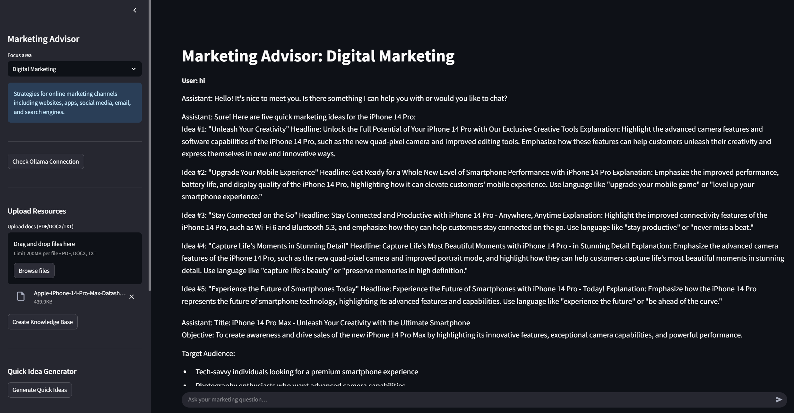

# ChatbotRAG

A Streamlit-based **Marketing Advisor** that uses Retrieval-Augmented Generation (RAG) over your own documents plus the AIDA framework, powered by a self-hosted Ollama LLM (forwarded via ngrok or hosted on Render.com) and a Chroma vector store.



---

## 🚀 Features

- **Custom Knowledge Base**  
  Upload PDF / DOCX / TXT files to build a domain-specific corpus.

- **Quick Idea Generator**  
  Instantly generate **5 marketing ideas** (headline + 1-sentence explanation) based on your docs.

- **AIDA Framework**  
  - **Explanation**: Learn the four steps—Attention, Interest, Desire, Action.  
  - **Plan**: Generate a full marketing plan structured by AIDA.

- **Chat Interface**  
  Ask free-form marketing questions answered from your uploaded content.

---

## 📁 Repo Structure

```
.
├── .gitignore
├── Procfile               # for Render.com deployment
├── app.py                 # main Streamlit application
├── requirements.txt       # Python dependencies
└── README.md              # this file
```

- **`app.py`**: Entry point for the Streamlit app.  
- **`requirements.txt`**: All Python packages required.  
- **`.gitignore`**: Excludes cache, vector DB, logs, histories, `.env`.  
- **`Procfile`**: `web: streamlit run app.py --server.port $PORT --server.address 0.0.0.0`

---

## 🛠 Local Setup

1. **Clone the repo**  
   ```bash
   git clone https://github.com/Chris-JDev/chatbotrag.git
   cd chatbotrag
   ```

2. **Create & activate a virtual environment**  
   ```bash
   python3 -m venv .venv
   source .venv/bin/activate    # macOS/Linux
   .venv\Scripts\activate     # Windows
   ```

3. **Install dependencies**  
   ```bash
   pip install -r requirements.txt
   ```

4. **Run Ollama and expose via ngrok**  
   ```bash
   # Start Ollama on port 11434
   ollama serve --host 0.0.0.0 --port 11434

   # In another terminal:
   ngrok http 11434
   ```
   Copy the HTTPS forwarding URL (e.g. `https://abcd1234.ngrok-free.app`).

5. **Create a `.env` file**  
   ```ini
   OLLAMA_BASE_URL=https://<your-ngrok-url>
   ```

6. **Launch the Streamlit app**  
   ```bash
   streamlit run app.py      --server.port 8501      --server.address 0.0.0.0
   ```
   Open <http://localhost:8501>.

---

## ☁️ Deploy on Render.com

1. **Ollama Service**  
   - New Web Service → connect any repo  
   - Start command:  
     ```
     ollama serve --host 0.0.0.0 --port 11434
     ```  
   - Set environment var:  
     ```
     OLLAMA_ORIGINS=["*"]
     ```  
   - Deploy and copy URL (e.g. `https://my-ollama.onrender.com`).

2. **Streamlit App Service**  
   - New Web Service → connect `Chris-JDev/chatbotrag`  
   - Build: `pip install -r requirements.txt`  
   - Start (Procfile):  
     ```
     web: streamlit run app.py --server.port $PORT --server.address 0.0.0.0
     ```  
   - Env var:  
     ```
     OLLAMA_BASE_URL=https://my-ollama.onrender.com
     ```  
   - Deploy.

---

## 🔒 Environment Variables

```
OLLAMA_BASE_URL=https://<your-ngrok-or-render-URL>
```
